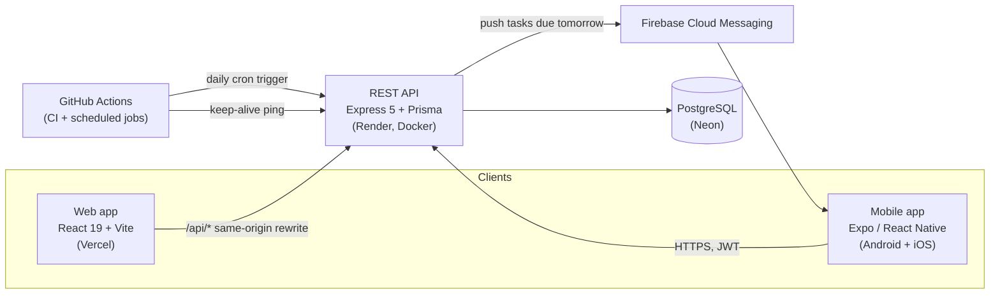
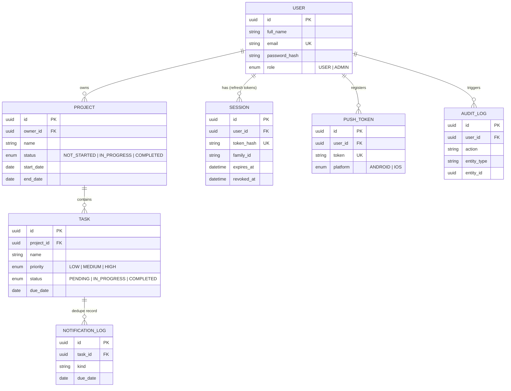

# PMS — Project Management System

A full-stack project/task management system: REST API, a React web app, and a React Native mobile app, sharing one Postgres database and one set of validation rules.

**Live:**
- Web app: https://pms-fullstack-six.vercel.app
- API: https://pms-backend-qiir.onrender.com (first request may take ~50s — see [Gotchas](#gotchas))
- API docs (Swagger UI): https://pms-backend-qiir.onrender.com/docs
- Mobile: Android APK — see [Mobile](#8-mobile-app) below; iOS via Expo Go

**Test accounts** (seed/demo data, not real people):
| Email | Password | Role |
|---|---|---|
| alice@example.com | Password123 | USER |
| bob@example.com | Password123 | USER |
| admin@example.com | Password123 | ADMIN |

---

## 1. Architecture



Both clients talk to the same API over HTTPS and share one `@pms/shared` Zod package for request/response validation, so a rule never drifts between platforms. The web app proxies `/api/*` through Vercel to Render same-origin (no CORS needed from the browser); the mobile app calls the API directly.

## 2. Tech stack and why

| Layer | Choice | Why |
|---|---|---|
| API | Express 5 + TypeScript | Mature, explicit middleware pipeline; Express 5's native async-error handling removes the need for wrapper boilerplate |
| ORM | Prisma 6 | Type-safe queries, migrations, and a schema that doubles as documentation |
| DB | PostgreSQL (Neon, serverless) | Relational data (users/projects/tasks) with real foreign keys; Neon gives branchable, pooled Postgres with no server to manage |
| Validation | Zod, in a shared `@pms/shared` workspace | One schema defines a form's client-side validation, the API's request validation, and the TypeScript type — used identically by web, mobile, and the backend |
| Web | React 19 + Vite + Tailwind v4 | Fast dev loop, no server-rendering complexity needed for an authenticated dashboard app |
| Mobile | Expo (React Native) + Expo Router | File-based routing, managed native builds (no manually maintained Xcode/Gradle projects), EAS for cloud Android builds |
| Data fetching | TanStack Query (both clients) | Cache, retry, and refetch-on-focus/pull-to-refresh behavior without hand-rolled state machines |
| Auth | JWT access token (15 min) + rotating, hashed, reuse-detected refresh tokens | Short-lived access tokens limit exposure; refresh-token rotation with family revocation detects and kills a stolen-token session automatically |
| Push | Firebase Cloud Messaging (FCM v1), direct from the backend via `firebase-admin` | No vendor relay in the delivery path; one Firebase project, one service-account key |
| CI/CD | GitHub Actions → Render (API, Docker) + Vercel (web) auto-deploy on push; EAS for Android builds | Every push to `main` is live within minutes; a scheduled Action also triggers the daily due-soon push job and pings the API to avoid Render's free-tier cold start |

## 3. Quick start

### Docker (fastest — full stack except mobile)

```bash
docker compose up --build
```

Brings up Postgres, runs migrations, and starts the API on `:4000`. Then, separately:

```bash
npm install
npm run dev:web      # web app on :5173, proxies /api to :4000 in dev
```

### Manual (all four workspaces)

```bash
npm install                                   # installs all workspaces
cp backend/.env.example backend/.env          # fill in secrets, see §5
docker compose -f docker-compose.dev.yml up -d  # Postgres only, for local dev
npm run build -w shared
npm run prisma:deploy -w backend
npm run prisma:seed -w backend
npm run dev -w backend       # API on :4000
npm run dev -w web           # web app on :5173
npm run start -w mobile      # Expo dev server; press a for Android emulator
```

## 4. Repo layout

```
shared/    @pms/shared — Zod schemas + inferred types, imported by backend, web, and mobile
backend/   Express API (routes → controller → service → Prisma), tests, Dockerfile
web/       React + Vite SPA
mobile/    Expo Router app (Android + iOS)
docs/      DECISIONS.md (design rationale), openapi.json (exported API spec)
```

## 5. Environment variables

### `backend/.env`
| Variable | Required | Notes |
|---|---|---|
| `DATABASE_URL` | yes | Pooled connection string (Neon pooler in prod, direct in local Docker) |
| `DIRECT_URL` | yes | Non-pooled connection, used for migrations |
| `JWT_ACCESS_SECRET` | yes | `openssl rand -hex 32`, min 32 chars |
| `CORS_ORIGINS` | yes | Comma-separated allow-list |
| `CRON_SECRET` | yes | `openssl rand -hex 16`; bearer token the scheduled job trigger must present |
| `APP_TIMEZONE` | no (default `Asia/Kolkata`) | Used to compute "today"/"tomorrow" for due-date logic independent of server UTC |
| `LOG_LEVEL` | no (default `info`) | pino log level |
| `FIREBASE_SERVICE_ACCOUNT_JSON` | no | Production: paste the FCM service-account key JSON as one line |
| `FIREBASE_SERVICE_ACCOUNT_PATH` | no (default `./secrets/firebase-service-account.json`) | Local dev: drop the downloaded key file here instead (gitignored) |

Push notifications no-op with a warning (not a crash) when neither Firebase variable resolves to a real key — dev and CI never need Firebase configured.

### `web/.env` (optional — only for pointing at a non-default API in dev)
Vite proxies `/api` to `http://localhost:4000` in dev automatically; in production the Vercel rewrite in `vercel.json` points at Render.

### `mobile/.env`
| Variable | Required | Notes |
|---|---|---|
| `EXPO_PUBLIC_API_URL` | no (defaults to the deployed Render API) | Override for local backend: `http://10.0.2.2:4000/api` on the Android emulator, or `expo start --tunnel` + that URL on a physical device |

## 6. Database

```bash
npm run prisma:deploy -w backend   # apply migrations
npm run prisma:seed -w backend     # alice/bob/admin + sample projects and tasks
```



A rendered PNG of this diagram is in `docs/er-diagram.png`.

## 7. API documentation

Interactive Swagger UI: https://pms-backend-qiir.onrender.com/docs (also served locally at `/docs`). Raw spec exported to `docs/openapi.json` via `npm run docs:export -w backend`.

All endpoints are under `/api`, require `Authorization: Bearer <accessToken>` except `/api/auth/register`, `/api/auth/login`, `/api/auth/refresh`, and the cron trigger (which instead requires `Authorization: Bearer <CRON_SECRET>`). Errors share one shape:

```json
{ "error": { "code": "VALIDATION_ERROR", "message": "...", "details": [{ "path": "email", "message": "..." }] } }
```

| Module | Endpoints |
|---|---|
| Auth | register, login, refresh (rotates the refresh token), logout, `GET /me` |
| Projects | full CRUD, search by name, filter by status, sort, pagination |
| Tasks | full CRUD, search, filter by status/priority, sort, pagination |
| Dashboard | per-user summary counts (totals, completed/pending, overdue, due-soon) |
| Admin (RBAC) | list users, list audit logs — `ADMIN` role only |
| Notifications | register/unregister a device push token, send a test push, the due-soon cron trigger |

## 8. Mobile app

### Against the deployed backend (default)
The APK and Expo Go both point at `https://pms-backend-qiir.onrender.com/api` out of the box — no setup needed.

**Install the APK:** built locally via Gradle (`mobile/android/app/build/outputs/apk/release/app-release.apk`, ~105MB, universal/all-ABIs) — not checked into git (`*.apk` is gitignored; it's a build artifact, not source). To install it on a phone:
- **USB**: enable Developer Options → USB debugging on the phone, connect it, then `adb install app-release.apk` from `mobile/android/app/build/outputs/apk/release/`.
- **Wi-Fi**: with the phone on the same network as the build machine, serve the file (`python -m http.server 8765` from that folder) and open `http://<build-machine-LAN-IP>:8765/app-release.apk` in the phone's browser to download and install (allow "install from unknown sources" when prompted).

A cloud-built APK via `eas build --platform android --profile preview` was also started (see PROGRESS.md) as a backup, since EAS's free-tier build queue can take hours; it produces a shareable Expo-hosted download link once it clears the queue.

**Expo Go** (fastest way to try it, works on iOS too): `cd mobile && npx expo start`, then scan the QR code. On a physical device, Expo Go talks directly to the deployed API, so no tunnel/network setup is required — if you'd rather point at a local backend, use `expo start --tunnel` instead.

### Against a local backend
- Android **emulator**: set `EXPO_PUBLIC_API_URL=http://10.0.2.2:4000/api` in `mobile/.env` (`10.0.2.2` is the emulator's alias for the host machine's `localhost`).
- Physical device: `expo start --tunnel` and use the tunnel URL, or stay on the deployed API.

### iOS
There is no standalone installable iOS build in this submission — producing a `.ipa` outside TestFlight/App Store requires a paid Apple Developer account, which is out of scope here. Expo Go is the verified cross-platform path and behaves identically to the Android dev build.

## 9. Security design

- **Passwords**: bcrypt-hashed, never logged (pino redaction list includes `password`, `passwordHash`, `token`, `accessToken`, `refreshToken`).
- **Access tokens**: JWT, HS256, 15-minute expiry.
- **Refresh tokens**: opaque random values, stored server-side only as a SHA-256 hash (never the raw token), rotated on every use. Each belongs to a *family*; reusing an already-rotated token revokes the entire family — a stolen-and-later-used refresh token kills every session descended from it, not just the one request.
- **Token storage**: web keeps the access token in a JS variable only (gone on reload, not readable by storage-targeting browser extensions) and the refresh token in an httpOnly cookie (never touches client JS). Mobile has no httpOnly-cookie equivalent, so both tokens live in `expo-secure-store` (iOS Keychain / Android Keystore).
- **Authorization**: every query is scoped by the authenticated user's id at the Prisma level (`WHERE ownerId = req.user.id`, etc.) — there is no endpoint that accepts a raw resource id without that scope, so one user can never read or mutate another user's data, admin included. A dedicated test proves an ADMIN promoted via SQL still gets 404 on another user's project through the normal `/api/projects/:id` route; admin-only data access is a *separate* `/admin/*` route namespace that only ever queries `User`/`AuditLog`.
- **Validation**: every request body/query/params is validated against the same Zod schema the client used to build the request, server-side, before touching the database.
- **Rate limiting**: a stricter limiter on `/api/auth/login` and `/api/auth/register`; a global limiter on everything else.
- **CORS**: exact-origin allow-list (`CORS_ORIGINS`), not `*`.
- **Secrets**: `.env*` (except `.env.example`) and `backend/secrets/` are gitignored; the Firebase service-account key never enters source control.
- **Audit log**: every auth event and every project/task create/update/delete is recorded with actor, action, entity, and IP; visible to admins at `/admin`.

## 10. Bonus features implemented

Refresh-token rotation with reuse detection · pagination + sorting on every list endpoint · unit + integration tests (backend) and component tests (web) · Docker (API + full-stack compose) · audit logs with an admin viewer · RBAC (`USER`/`ADMIN`) · one shared Zod validation package across all three codebases · CI (GitHub Actions) with auto-deploy to Render/Vercel on push, plus a manual EAS workflow for Android builds · offline viewing on mobile (persisted query cache + NetInfo-driven offline banner) · push notifications for tasks due tomorrow (FCM v1, deduped via `notification_log`, triggered by a scheduled GitHub Action).

**Honest limits**: no standalone iOS build (see §8); mobile's offline support is read-only — cached data renders while offline, but there's no write queue for actions taken while disconnected (they're blocked with a clear message instead of silently queued, to avoid presenting fake success).

## 11. Testing and CI

```bash
npm run test -w backend    # Vitest + Supertest, real Postgres test DB
npm run test -w web        # Vitest + Testing Library
npm run test -w mobile     # Jest (jest-expo preset)
npm run typecheck --ws     # tsc --noEmit, every workspace
npm run lint                # eslint, repo-wide
```

CI (`.github/workflows/ci.yml`) runs typecheck, lint, and the full backend test suite (with a real Postgres service container) on every push and PR. `keep-alive.yml` pings `/health` every 5 minutes so the Render free-tier instance doesn't cold-start before a review. `due-soon-notifications.yml` triggers the push job daily.

## 12. Design decisions and trade-offs

See [`docs/DECISIONS.md`](docs/DECISIONS.md) for the reasoning behind the non-obvious choices in this project — why Prisma was pinned, the three real bugs found through live testing (not just green test suites) and how each was fixed, the platform differences between web and mobile auth storage, and the environment issues hit along the way.
