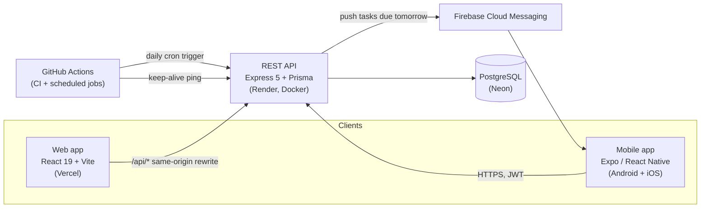
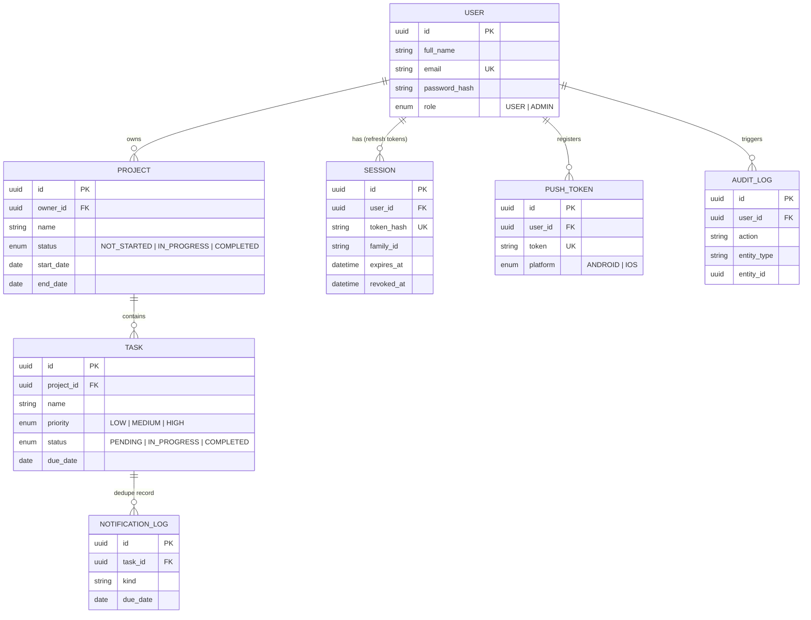

# PMS — Project Management System

A simple project & task manager, built three times over: as a REST API, a React website, and a React Native mobile app. All three talk to the same backend and database, and share one set of validation rules, so nothing gets out of sync between platforms.

In plain words: a user can sign up, log in, create projects, add tasks to those projects, mark them done, and get a notification on their phone the day before a task is due. Admins get an extra screen to see every user and everything that happened (an audit log).

**Live:**
- Web app: https://pms-fullstack-six.vercel.app
- API: https://pms-backend-qiir.onrender.com (first request may take ~50s — the free hosting tier "sleeps" when idle, see [Gotchas](#gotchas))
- API docs (Swagger UI): https://pms-backend-qiir.onrender.com/docs
- Mobile: Android APK — see [Mobile](#8-mobile-app) below; iOS via Expo Go

**Test accounts** (seed/demo data, not real people):
| Email | Password | Role |
|---|---|---|
| alice@example.com | Password123 | USER |
| bob@example.com | Password123 | USER |
| admin@example.com | Password123 | ADMIN |

---

## 1. How it's put together



In plain words: the web app and the mobile app are just two different "front doors" — neither one talks to the database directly. They both send normal HTTPS requests to one Express API, which is the only thing that touches Postgres. That's why a task created on the phone shows up instantly on the website too — there's only one source of truth.

The web app routes its `/api/*` calls through Vercel to Render so the browser never has to deal with cross-origin requests. The mobile app just calls the API's URL directly, since there's no browser same-origin rule to work around on a phone.

One extra piece: a `@pms/shared` package holds every validation rule (e.g. "a task name can't be empty", "priority must be LOW/MEDIUM/HIGH") as Zod schemas. All three codebases import the *same* file, so the web form, the mobile form, and the API's own request validation can never quietly drift apart.

## 2. What I used, and why (in plain terms)

| Layer | Choice | Why I picked it |
|---|---|---|
| API | Express 5 + TypeScript | A simple, well-understood way to define routes; TypeScript catches mistakes before runtime |
| ORM | Prisma | Lets me write database queries as normal JS/TS instead of raw SQL, and its schema file doubles as documentation of the whole data model |
| Database | PostgreSQL (hosted on Neon) | A real relational database — projects and tasks naturally have foreign-key relationships, so SQL fits better than a document store |
| Validation | Zod, in one shared package | Write a rule once, use it in three places (web form, mobile form, API) — so they're always in sync |
| Web | React 19 + Vite + Tailwind | Fast to build with, no server-rendering complexity needed since every page is behind a login |
| Mobile | Expo (React Native) | One codebase for both Android and iOS, and I don't have to hand-maintain native Xcode/Gradle projects |
| Data fetching | TanStack Query (web + mobile) | Handles caching, retrying, and "refresh when the user comes back to this screen" automatically, instead of writing that logic by hand |
| Auth | Short-lived JWT + rotating refresh tokens | Explained in plain words in [§9 Security](#9-security-design) below |
| Push notifications | Firebase Cloud Messaging | The standard, free way to push a notification to an Android/iOS device |
| CI/CD | GitHub Actions → auto-deploy to Render + Vercel | Every push to `main` goes live in a few minutes, without me doing it by hand |

## 3. Running it yourself

### Fastest way (Docker — everything except mobile)

```bash
docker compose up --build
```

This starts Postgres, runs the database migrations, and starts the API on port `4000`. Then, in a separate terminal:

```bash
npm install
npm run dev:web      # web app on :5173, talks to the API on :4000
```

### Doing it by hand (all four parts)

```bash
npm install                                   # installs everything, all 4 workspaces
cp backend/.env.example backend/.env          # fill in the secrets, see §5 below
docker compose -f docker-compose.dev.yml up -d  # just Postgres, for local dev
npm run build -w shared
npm run prisma:deploy -w backend
npm run prisma:seed -w backend
npm run dev -w backend       # API on :4000
npm run dev -w web           # web app on :5173
npm run start -w mobile      # Expo dev server; press "a" for the Android emulator
```

## 4. Where everything lives

```
shared/    One package of validation rules (Zod schemas), used by all three apps below
backend/   The Express API — routes → controller → service → Prisma → database
web/       The React website
mobile/    The Expo (React Native) app, for Android and iOS
docs/      Exported API spec (openapi.json) and a picture of the database diagram
```

Inside `backend/`, a request flows in one direction: **route** (just wiring) → **controller** (reads the request, calls the service, sends the response) → **service** (the actual business logic) → **Prisma** (talks to Postgres). That split makes it easy to find where any given rule lives — if it's "what happens when a task is created," it's in `tasks.service.ts`, not scattered across the route file.

## 5. Environment variables

### `backend/.env`
| Variable | Required? | What it's for |
|---|---|---|
| `DATABASE_URL` | yes | Connection string the app uses for normal queries |
| `DIRECT_URL` | yes | A non-pooled connection, only used when running migrations |
| `JWT_ACCESS_SECRET` | yes | The secret key used to sign login tokens (`openssl rand -hex 32`) |
| `CORS_ORIGINS` | yes | Which websites are allowed to call this API from a browser |
| `CRON_SECRET` | yes | A password the daily notification job must present, so no one else can trigger it |
| `APP_TIMEZONE` | no (default `Asia/Kolkata`) | Which timezone counts as "today" when deciding if a task is due soon |
| `LOG_LEVEL` | no (default `info`) | How chatty the server logs are |
| `FIREBASE_SERVICE_ACCOUNT_JSON` | no | The Firebase key, for sending push notifications in production |
| `FIREBASE_SERVICE_ACCOUNT_PATH` | no | Same key, but as a local file path, for local dev |

If the Firebase key isn't set, push notifications just quietly skip themselves (log a warning) instead of crashing — so you don't need Firebase configured just to run the app locally.

### `web/.env`
Not needed normally — in dev, Vite automatically forwards `/api` calls to `localhost:4000`.

### `mobile/.env`
| Variable | Required? | What it's for |
|---|---|---|
| `EXPO_PUBLIC_API_URL` | no (defaults to the live Render API) | Point the app at a local backend instead — `http://10.0.2.2:4000/api` on the Android emulator |

## 6. The database, in plain terms

There are 6 tables. A **User** owns **Projects**, a **Project** contains **Tasks**. A **Session** is one refresh-token record (used for login). A **PushToken** is a phone's device ID for sending it notifications. An **AuditLog** row is written every time something important happens (login, task created, etc.) and a **NotificationLog** row exists just to make sure the same "task due tomorrow" push is never sent twice.

```bash
npm run prisma:deploy -w backend   # apply migrations
npm run prisma:seed -w backend     # creates alice/bob/admin + sample projects and tasks
```



A picture of this same diagram is saved at `docs/er-diagram.png`.

## 7. The API, in short

Full interactive docs: https://pms-backend-qiir.onrender.com/docs (same thing locally at `/docs`). The raw spec is also exported to `docs/openapi.json`.

Every route needs `Authorization: Bearer <accessToken>` *except* register, login, refresh, and the cron trigger (which needs a different secret instead). Every error comes back in the same shape, so the frontend only has to handle one format:

```json
{ "error": { "code": "VALIDATION_ERROR", "message": "...", "details": [{ "path": "email", "message": "..." }] } }
```

| Module | What it does |
|---|---|
| Auth | register, login, refresh (rotates the refresh token), logout, "who am I" |
| Projects | create/read/update/delete, search by name, filter by status, sort, pagination |
| Tasks | create/read/update/delete, search, filter by status/priority, sort, pagination |
| Dashboard | a quick summary: how many tasks total, done, pending, overdue, due soon |
| Admin | list all users, view the audit log — only works if your account's role is ADMIN |
| Notifications | register/remove a phone for push notifications, send a test push, the daily due-soon job |

## 8. Mobile app

### Using the live backend (default — no setup)
Both the APK and Expo Go already point at the deployed API, so there's nothing to configure.

**Installing the APK:** built locally with Gradle (`mobile/android/app/build/outputs/apk/release/app-release.apk`, about 105MB) — it's not checked into git, since it's a build output, not source code.
- **USB**: turn on Developer Options → USB debugging on the phone, plug it in, then run `adb install app-release.apk` from that folder.
- **Wi-Fi**: with the phone on the same network, run `python -m http.server 8765` in that folder and open `http://<your-computer's-LAN-IP>:8765/app-release.apk` on the phone to download and install it (you'll need to allow "install from unknown sources").

**Expo Go** (the quickest way to try it, and it also works on iOS): run `cd mobile && npx expo start`, then scan the QR code with the Expo Go app. It talks straight to the live API, so there's no extra network setup needed.

### Pointing it at your own local backend instead
- Android emulator: set `EXPO_PUBLIC_API_URL=http://10.0.2.2:4000/api` in `mobile/.env`.
- Physical device: run `expo start --tunnel` and use the tunnel URL it gives you.

### Why there's no iOS build to install directly
Building an installable `.ipa` outside of Apple's TestFlight/App Store needs a paid Apple Developer account, which was out of scope here. Expo Go covers iOS just fine for demo purposes and behaves identically to the Android build.

## 9. Security design (explained simply)

- **Passwords** are never stored as plain text — they're hashed with bcrypt, and the logger is configured to never even print a password or token to the console.
- **Login tokens** (JWTs) expire after 15 minutes. Short-lived on purpose: if one ever leaked, it's only useful for a few minutes.
- **Refresh tokens** are what let you stay logged in without re-entering your password every 15 minutes. Each one is a random value; the server only ever stores its hash, never the real value. Every time it's used, it's swapped out for a brand new one ("rotated"). If someone ever tries to reuse an *old* one — which should never happen in normal use — that's treated as a sign of theft, and every session in that login's whole chain gets logged out at once.
- **Where tokens are stored:** on the web, the access token lives only in memory (gone if you refresh the page, and not something a browser extension can quietly read off disk); the refresh token sits in an httpOnly cookie, which JavaScript can never read at all. On mobile, both tokens go into the phone's secure storage (the same encrypted vault iOS/Android use for other apps' secrets).
- **Authorization:** every single database query is automatically scoped to "the thing that belongs to the currently logged-in user." There's no endpoint where you can just plug in someone else's ID and see their data — not even for an admin account, who gets their own separate `/admin` routes instead of wider access to the normal ones.
- **Input validation:** every request is checked against the same rules the frontend form used, again on the server, before anything touches the database.
- **Rate limiting:** login and register are limited more strictly than everything else, to slow down brute-force guessing.
- **CORS:** only a specific, named list of websites is allowed to call the API from a browser — not "anyone."
- **Secrets never get committed:** `.env` files and the Firebase key are all excluded from git.
- **Audit log:** every login, and every project/task change, is recorded with who did it, what they did, and from where — viewable by admins.

## 10. Extra things built beyond the minimum ask

Refresh-token rotation with theft detection · pagination & sorting on every list · automated tests (backend unit + integration, web component tests) · Docker setup for the whole stack · an audit log with an admin screen to view it · role-based access (USER/ADMIN) · one shared validation package instead of three separate copies · CI that auto-deploys on every push · offline viewing on mobile (cached data still shows with no internet, plus an "offline" banner) · push notifications the day before a task is due.

**Being upfront about limits:** there's no standalone iOS install (see §8) — Expo Go covers it instead. And mobile's offline mode is read-only: you can still see your tasks with no signal, but actions taken while offline are blocked with a clear message rather than being queued and silently retried later.

## 11. Tests and CI

```bash
npm run test -w backend    # backend tests, against a real test database
npm run test -w web        # web component tests
npm run test -w mobile     # mobile tests
npm run typecheck --ws     # type-checks every workspace
npm run lint                # lint, repo-wide
```

Every push and every PR automatically runs type-checking, linting, and the full backend test suite (against a real Postgres instance, not a mock) via GitHub Actions. A separate scheduled job pings the API every 5 minutes so it doesn't "fall asleep" on the free hosting tier, and another one triggers the daily due-soon push job.

## Gotchas

- **First request after a while feels slow (~50s):** the free Render tier spins the server down when nobody's used it; the very next request wakes it back up. The keep-alive Action above is there specifically to minimize this during a review window — if you still hit it, it just means it's been idle longer than 5 minutes.
